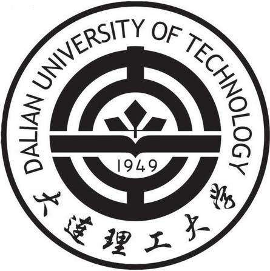

## About Me
I'm Meng Liu (刘萌), I currently a Professor with the School of Computer Science and Technology, Shandong Jianzhu University. I received the Ph.D. degree from the Shandong University, Qingdao China, advised by [Prof. Baoquan Chen](https://cfcs.pku.edu.cn/baoquan/) and [Prof. Liqiang Nie](https://liqiangnie.github.io/). My research focused on multimedia computing and information retrieval. I obtained my M.S. degree in computational mathematics from Dalian University of Technology, China, in 2016. I did internship at National University of Singapore from 2017 to 2018, advised by [Prof. Tat-Seng Chua](https://www.comp.nus.edu.sg/cs/bio/chuats/). 

## Education

        <strong> Shandong University, Qingdao, China (Sep 2016 - Dec 2019) </strong>
           
        <ul>
        <li>
          Doctor of Philosophy (Ph.D), Computer Science and Technology</li>
        <li>
          Advisor: Prof. Baoquan Chen and Prof. Liqiang Nie</li>
      </ul>      
      

        <strong> Dalian University of Technology, Dalian, China (Sep 2013 - Jun 2016) </strong>
          <a href="https://www.dlut.edu.cn/" target="_blank" rel="external">
            
          </a> 
        <ul>
        <li>
          Master of Science (M.S), Computational Mathematics</li>
        <li>
          Advisor: Prof. Xiuping Liu</li>
      </ul>      
      

      

        <strong> Henan University, Kaifeng, China (Sep 2009 - Jun 2013) </strong>
          <a href="http://www.henu.edu.cn/" target="_blank" rel="external">
            
          </a> 
        <ul>
        <li>
          Bachelor of Science (B.S), Mathematics and Applied Mathematics</li>
        <li>
          Graduated with Excellent Thesis Award</li>
      </ul>      
      

## Experience
     

        <strong> National University of Singapore, NUS, Singapore  (Oct 2017 - Oct 2018) </strong>
          <a target="_blank" rel="external">
            
          </a> 
        <ul>
        <li>
          Position: Research Intern, in NEXT++, School of Computing </li>
                
        <li>Cross-modal Moment Retrieval in videos via Language. </li>
      </ul>      
      

      
## Publications
**Meng Liu**, Liqiang Nie, Meng Wang, Baoquan Chen, "_Towards Micro-video Understanding by Joint Sequential-Sparse Modeling_", ACM Conference on Multimedia  (**ACM MM**), 2017. [code](https://acmmm17.wixsite.com/eastern)

**Meng Liu**, Xiang Wang, Liqiang Nie, Qi Tian, Baoquan Chen, Tat-Seng Chua,  "_Cross-modal Moment Localization in Videos_", ACM Conference on Multimedia (**ACM MM**), 2018. [code](https://acmmm18.wixsite.com/role)

**Meng Liu**, Xiang Wang, Liqiang Nie, Baoquan Chen, Tat-Seng Chua, "_Attentive Moment Retrieval in Videos_",  ACM SIGIR 2018 Conference on Research and Development in Information Retrieval, (**ACM SIGIR**), 2018. [code](https://sigir2018.wixsite.com/acrn) 

Jichao Zhang, Yezhi Shu, Songhua Xu, Gongze Cao, Fan Zhong, **Meng Liu**, Xueying Qin, "_Sparsely Grouped Multi-Task Generative Adversarial Networks for Facial Attribute Manipulation_", ACM Conference on Multimedia, (**ACM MM**), 2018. 

**Meng Liu**, Liqiang Nie, Xiang Wang, Qi Tian, Baoquan Chen, "_Online Data Organizer: Micro-video Categorization by Structure-guided Multimodal Dictionary Learning_", IEEE Transactions on Image Processing (**IEEE TIP**), 2019. [code](http://acmmm17.wixsite.com/intimate)

Xiang Wang, Xiangnan He, Yixin Cao, **Meng Liu**, Tat-Seng Chua, "_KGAT: Knowledge Graph Attention Network for Recommendation_",  ACM SIGKDD Conference on Knowledge Discovery and Data Mining, (**ACM KDD**), 2019. [code](https://github.com/xiangwang1223/knowledge_graph_attention_network)

Liqiang Nie, **Meng Liu**, Xuemeng Song, "_Multimodal Learning toward Micro-Video Understanding_", Synthesis Lectures on Image, Video, and Multimedia Processing, (book), 2019.

Yongqi Li, **Meng Liu**, Jianhua Yin, Chaoran Cui, Xin-Shun Xu and Liqiang Nie, "_Routing Micro-videos via A Temporal Graph-guided Recommendation System_", ACM Conference on Multimedia, (**ACM MM**), 2019. [code](https://anonymous1240.wixsite.com/alpine)

Tian Gan, Shaokun Wang, **Meng Liu**, Xumeng Song, Yiyang Yao and Liqiang Nie, "_Seeking Micro-influencers for Brand Promotion_", ACM Conference on Multimedia, (**ACM MM**), 2019. [code](https://github.com/gantian/ACMMM-2019-influencer)

Hao Jiang, Wenjie Wang, **Meng Liu**, Liqiang Nie, Ling-Yu Duan and Changsheng Xu, "_Market2Dish: A Health-aware Food Recommendation System_", ACM Conference on Multimedia, (**ACM MM**), 2019. 

Mengmeng Li, Tian Gan, **Meng Liu**, Zhiyong Cheng, Jianhua Yin and Liqiang Nie, "_Long-tail Hashtag Recommendation for Micro-videos with Graph Convolutional Network_", ACM International Conference on Information and Knowledge Management, (**ACM CIKM**), 2019. [code](https://anon425.wixsite.com/v2ht)

Changfeng Sun, Han Liu, **Meng Liu**, Zhaochun Ren, Tian Gan and Liqiang Nie, "_LARA: Attribute-to-feature Adversarial Learning for Item Cold-start Recommendation_", ACM International Conference on Web Search and Data Mining, (**ACM WSDM**), 2020. [code](https://anonymous274.wixsite.com/lara)

Shengjing Tian, Xiuping Liu, **Meng Liu**, Shuhua Li and Baocai Li, "_Siamese Tracking Network with Informative Enhanced Loss_", IEEE Transactions on Multimedia, (**IEEE TMM**), 2020.

Haoyu Tang, Jihua Zhu, **Meng Liu**, Zan Gao, Zhiyong Cheng, "_Frame-wise Cross-modal Match for Video Moment Retrieval_", IEEE Transactions on Multimedia, (**IEEE TMM**), 2020.

Hongchen Tan, Xiuping Liu, **Meng Liu**, Baocai Yin, Xin Li, "_KT-GAN: Knowledge-Transfer Generative Adversarial Network for Text-to-Image Synthesis_", IEEE Transactions on Image Processing, (**IEEE TIP**), 2020.

**Meng Liu**, Leigang Qu, Liqiang Nie, Maofu Liu, Lingyu Duan, Baoquan Chen, "_Iterative Local-Global Collaboration Learning Towards One-Shot Video Person Re-Identification_", IEEE Transactions on Image Processing, (**IEEE TIP**), 2020. [code](https://github.com/LgQu/VOLTA)

Da Cao, Yawen Zeng, **Meng Liu**, Xiangnan He, Meng Wang, Zheng Qin, "_STRONG: Spatio-Temporal Reinforcement Learning for Cross-Modal Video Moment Localization_", Proceedings of the 28th ACM International Conference on Multimedia, (**ACM MM**), 2020. [code](https://github.com/yawenzeng/STRONG)

Leigang Qu, **Meng Liu**, Da Cao, Liqiang Nie, Qi Tian, "_Context-Aware Multi-View Summarization Network for Image-Text Matching_", Proceedings of the 28th ACM International Conference on Multimedia, (**ACM MM**), 2020. [code](https://acmmmcamera.wixsite.com/camera)

Yuchao Liu, **Meng Liu**, Jianhua Yin, "_Toward community answer selection by jointly static and dynamic user expertise modeling_", APSIPA Transactions on Signal and Information Processing, 2021.

Yawen Zeng, Da Cao, Xiaochi Wei, **Meng Liu**, Zhou Zhao, Zheng Qin, "_Multi-Modal Relational Graph for Cross-Modal Video Moment Retrieval_", IEEE Conference on Computer Vision and Pattern Recognition, (**IEEE CVPR**), 2021. [code](https://cvpr-2021.wixsite.com/mmrg)

Yupeng Hu, **Meng Liu**, Xiaobin Su, Zan Gao, Liqiang Nie, "_Video Moment Localization via Deep Cross-Modal Hashing_", IEEE Transactions on Image Processing, (**IEEE TIP**), 2021. [code](https://github.com/Huyp777/CMHN)

Yupeng Hu, Liqiang Nie, **Meng Liu**, Kun Wang, Yinglong Wanga, Xiansheng Hua, "_Coarse-to-Fine Semantic Alignment for Cross-modal Moment Localization_", IEEE Transactions on Image Processing, (**IEEE TIP**), 2021. [code](https://github.com/Huyp777/CSUN)

Leigang Qu, **Meng Liu**, Jianlong Wu, Zan Gao, Liqiang Nie, "_Dynamic Modality Interaction Modeling for Image-Text Retrieval_", ACM SIGIR Conference on Research and Development in Information Retrieval, (**ACM SIGIR**), 2021. (Best Student Paper) [code](https://sigir21.wixsite.com/dime)

Xiao Zhang, **Meng Liu**, Jianhua Yin, Zhaochun Ren, Liqiang Nie，"_Question Tagging via Graph-guided Ranking_", ACM Transactions on Information Systems, (**ACM TOIS**), 2021. [code](https://anonymousrank.wixsite.com/here)

## Grants
NSFC, Youth Science Fund Project，NO.62006142，Multi-modal explicit relationship modeling for micro-video analysis, 2021-01--2023-12

## Professional Services
Conference Reviewer for International Conference on Multimedia Modeling, ACM Conference on Multimedia, Pacific-Rim Conference on Multimedia, CVPR, AAAI, COLING, ICCV, WSDM.

Journal Reviewer for Information Sciences, Journal of Visual Communication and Image Representation, Multimedia Systems Journal, Pattern Recognation, IEEE Transactions on Image Processing, Journal of Electronic Imaging, IEEE Transactions on Knowledge and Data Engineering, and IEEE Transactions on Multimedia.

## Awards
ACM SIGIR 18 Student Travel Grant, 2018

ACM MM 18 Student Travel Grant, 2018

Outstanding Graduate Student at Shandong University, 2018

First Class Doctoral Academic Scholarship at Shandong University, 2018

Huawei Scholarship at Shandong University, 2018

ACM MM 17 Student Travel Grant, 2017

Doctoral Academic Scholarship at Shandong University, 2017

Outstanding Graduates at Dalian University of Technology, 2016

National Scholarship, 2015

Dalian University of Technology Scholarship, 2013-2016
    
