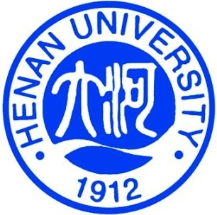
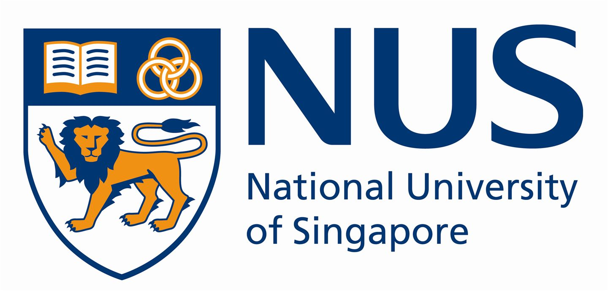

## About Me

I’m Haoyu Zhang (张昊宇), I currently a Master Student with the School of Computer Science and Technology, Shandong University, advised by [Prof. Liqiang Nie](https://liqiangnie.github.io/) and [Prof. Meng Liu](https://mengliu1991.github.io/). My research focused on Multimodal Dialog.

## Education

        <strong> Shandong University, Qingdao, China (Sep 2020 - Now) </strong>
           
        <ul>
        <li>
          Master of Engineering (M.E.), Electronic Information</li>
        <li>
          Advisor: Prof. Liqiang Nie</li>
      </ul>      
      

      

        <strong> Shandong University of Science and Technology, Qingdao, China (Sep 2016 - Jun 2020) </strong>
          <a href="http://www.henu.edu.cn/" target="_blank" rel="external">
            
          </a> 
        <ul>
        <li>
          Bachelor of Engineering (B.E.), Digital Media Technologies</li>
      </ul>      
      

## Experience
     

        <strong> Alibaba Group, Hangzhou, China  (Wed 2022 - Now) </strong>
          <a target="_blank" rel="external">
            
          </a> 
        <ul>
        <li>
          Position: Academic Intern, in Alibaba Cloud Intelligence </li>
                
        <li>Partial Person Re-identification  </li>
      </ul>      
      

      
## Publications

**Haoyu Zhang**, Meng Liu, Zan Gao, Xiaoqiang Lei, Yinglong Wang, Liqiang Nie. "_Multimodal Dialog System: Relational Graph-based Context-aware Question Understanding_". ACM Conference on Multimedia, (**ACM MM**), 2021. [code](https://acmmmtreasure.wixsite.com/treasure)

## Awards

ACM MM 21 Student Travel Grant, 2021

National Scholarship, 2021

Top 10 Outstanding Students of the School of Computer Science, 2019

Outstanding Graduates of Shandong Province, 2019

First Class Academic Scholarship, 2016-2020
