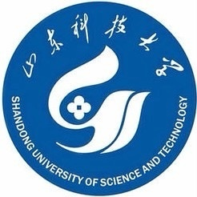
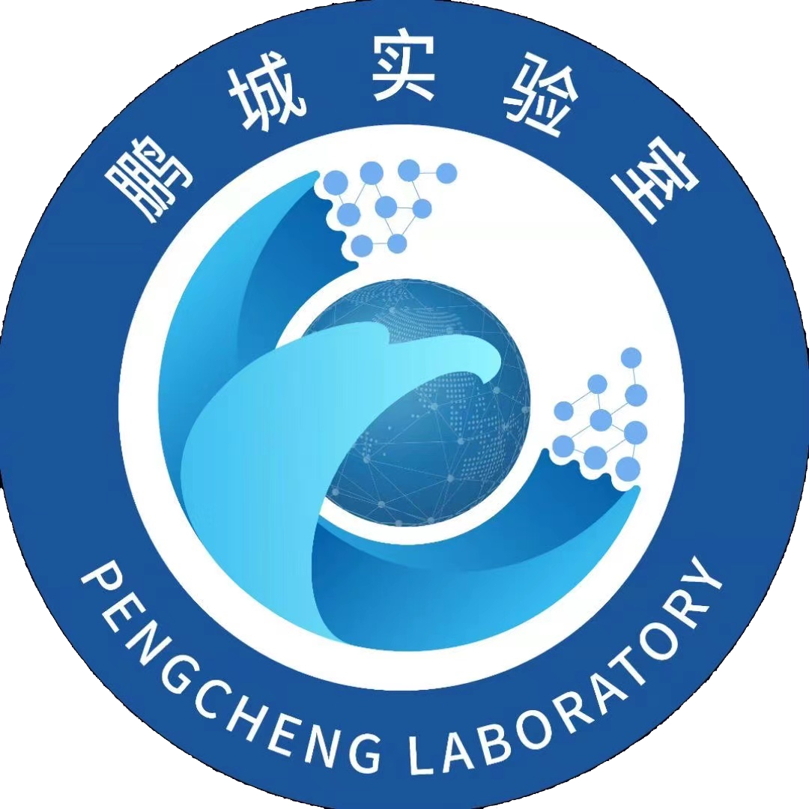

## About Me

I’m Haoyu Zhang (张昊宇), and I am currently a PhD Student at the School of Computer Science and Technology, [Harbin Institute of Technology (Shenzhen)](https://www.hitsz.edu.cn/), advised by [Prof. Liqiang Nie](https://liqiangnie.github.io/) and [Prof. Meng Liu](https://mengliu1991.github.io/). Also I am a Co-culture Student at [Pengcheng Laboratory](https://www.pcl.ac.cn/) under the supervision of Prof. Yaowei Wang. Before that, I received my M.E. degree in the School of Computer Science and Technology from [Shandong University](https://www.sdu.edu.cn/), advised by Prof. Liqiang Nie and Prof. Meng Liu. My research interests include Multimodal Dialog and Person Re-identification.

## Education

        <strong> Harbin Institute of Technology, Shenzhen, China</strong>
           
        <ul>
        <li>School of Computer Science and Technology, Sep 2023 - Now </li>
        <li>
          Doctor, Advisor: Prof. Liqiang Nie and Prof. Meng Liu</li>
      </ul>      
      

        <strong> Shandong University, Qingdao, China</strong>
           
        <ul>
        <li>School of Computer Science and Technology, Sep 2020 - Jun 2023 </li>
        <li>
          Master, Advisor: Prof. Liqiang Nie and Prof. Meng Liu</li>
      </ul>      
      

      

        <strong> Shandong University of Science and Technology, Qingdao, China</strong>
          <a target="_blank" rel="external">
            
          </a> 
        <ul>
        <li>
          School of Computer Science and Engineering, Sep 2016 - Jun 2020</li>
        <li>
          Bachelor, Graduated with Excellent Thesis Award</li>
      </ul>      
      

## Experience

        <strong> Pengcheng Laboratory, Shenzhen, China  (Sep 2023 - Now) </strong>
          <a target="_blank" rel="external">
            
          </a> 
        <ul>
        <li>
          Co-culture Student, in Department of Network Intelligence </li>
        <li>
          Advisor: Prof. Yaowei Wang  </li>
      </ul>      
      
    
      

        <strong> Alibaba Group, Hangzhou, China  (Wed 2022 - Jun 2022) </strong>
          <a target="_blank" rel="external">
            
          </a> 
        <ul>
        <li>
          Academic Intern, in Alibaba Cloud Intelligence </li>
        <li>
          Project: Partial Person Re-identification  </li>
      </ul>      
      

      
## Publications

**Haoyu Zhang**, Meng Liu, Yuhong Li, Ming Yan, Zan Gao, Xiaojun Chang, Liqiang Nie. "_Attribute-guided Collaborative Learning for Partial Person Re-identification (**IEEE TPAMI**), CCF-A, SCI-1, 2023. 
[Paper]()  [Code]()  [Video]()

Weili Guan, Xuemeng Song, **Haoyu Zhang**, Meng Liu, Chung-Hsing Yeh, Xiaojun Chang. "_Bi-directional Heterogeneous Graph Hashing towards Efficient Outfit Recommendation_". ACM International Conference on Multimedia (**ACM MM**), CCF-A, Oral, 2022. 
[Paper](https://dl.acm.org/doi/pdf/10.1145/3503161.3548020)  [Code](https://outfitrec.wixsite.com/bihgh)  [Video](https://dl.acm.org/doi/10.1145/3503161.3548020)

**Haoyu Zhang**, Meng Liu, Zan Gao, Xiaoqiang Lei, Yinglong Wang, Liqiang Nie. "_Multimodal Dialog System: Relational Graph-based Context-aware Question Understanding_". ACM International Conference on Multimedia (**ACM MM**), CCF-A, Full Paper, 2021. 
[Paper](https://dl.acm.org/doi/pdf/10.1145/3474085.3475234)  [Code](https://acmmmtreasure.wixsite.com/treasure)  [Video](https://dl.acm.org/doi/abs/10.1145/3474085.3475234)

## Professional Services

Conference Reviewer: ACM MM 2022, NeurIPS 2022, ICML 2023, NeurIPS 2023, ACM MM 2023, PRCV 2023.

Journal Reviewer: Information Sciences 2022, IEEE TCSVT 2023, IEEE TMM 2023, IEEE TKDE 2023.

## Awards

Outstanding Graduates of Shandong University, 2023

National Scholarship, 2021

Outstanding Graduate Student of Shandong University, 2021

ACM MM Student Travel Grant, 2021

Outstanding Graduates of Shandong Province, 2020

Outstanding Graduates from Shandong University of Science and Technology, 2020

Top 10 Outstanding Students in the School of Computer Science and Engineering, 2019

Provincial Government Encouragement Scholarship, 2018

National Encouragement Scholarship, 2017

First Class Academic Scholarship, 2016-2020

## Competitions

WSDM Cup 2023-Toloka Visual Question Answering Challenge, 6th

## Patents

对话意图识别、用于识别对话意图的模型的训练方法, CN113590798A
