

  

    

      

        
        <h1 class="h2">Haoyu Zhang</h1>
        
PhD Student Harbin Institute of Technology (Shenzhen)

        

          

            <a href="https://www.hitsz.edu.cn/" target="_blank" rel="noopener">School of Computer Science and Technology</a>
          

          <!-- 
Egocentric Vision and Spatial Understanding
 -->
        

        

          
zhang.hy.2019 AT gmail.com

        

        <ul class="network-icon" aria-hidden="true">
          <li><a href="mailto:zhang.hy.2019@gmail.com"><i class="fas fa-envelope big-icon"></i></a></li>
          <li><a href="https://scholar.google.com/citations?hl=zh-CN&user=HGPmq2YAAAAJ" target="_blank" rel="noopener"><i class="fas fa-graduation-cap big-icon"></i></a></li>
          <li><a href="https://github.com/Hyu-Zhang" target="_blank" rel="noopener"><i class="fab fa-github big-icon"></i></a></li>
          <li><a href="assets/CV.pdf" target="_blank" rel="noopener"><i class="far fa-file-lines big-icon"></i></a></li>
        </ul>
      

    

    

      <section id="about" class="home-section wg-aboutme" style="padding: 0 0 0 0;">
        

        

          

            

              
I am <strong>Haoyu Zhang</strong> (张昊宇), a Ph.D. candidate at the School of Computer Science and Technology, <a href="https://www.hitsz.edu.cn/" target="_blank" rel="noopener">Harbin Institute of Technology (Shenzhen)</a>, under the supervision of <a href="https://liqiangnie.github.io/" target="_blank" rel="noopener">Prof. Liqiang Nie</a>, <a href="https://scholar.google.com/citations?user=o_DllmIAAAAJ&hl=zh-CN" target="_blank" rel="noopener">Prof. Yaowei Wang</a>, and <a href="https://mengliu1991.github.io/" target="_blank" rel="noopener">Prof. Meng Liu</a>. Prior to this, I received my M.S. degree from the School of Computer Science and Technology at <a href="https://www.sdu.edu.cn/" target="_blank" rel="noopener">Shandong University</a>, where I was advised by Prof. Liqiang Nie and Prof. Meng Liu.

              
My research interests include multimodal retrieval, egocentric vision, and spatial intelligence. To date, I have published more than 10 papers in leading CCF-A conferences and journals, including IEEE TPAMI, ACM TOIS, CVPR, ICML, NeurIPS, AAAI, and ACM MM. I have also achieved strong results in international CVPR challenges, securing 9 first-place finishes, 2 second-place finishes, and 3 third-place finishes.

              

                

                  
<strong><u>Multimodal Retrieval</u></strong>   &rarr; show/hide representative work on multimodal retrieval.

                  <ul class="research-bullets">
                    <li>Dialogue Systems: <a href="https://dl.acm.org/doi/pdf/10.1145/3474085.3475234">TREASURE</a> (MM’21), <a href="https://arxiv.org/pdf/2310.07259">ISR</a> (TOIS’26)</li>
                    <li>Recommendation: <a href="https://dl.acm.org/doi/pdf/10.1145/3503161.3548020">BiHGH</a> (MM’22), <a href="https://arxiv.org/pdf/2604.20318">UniCVR</a></li>
                    <li>Person Re-Identification: <a href="https://ieeexplore.ieee.org/stamp/stamp.jsp?tp=&arnumber=10239469">AGCL</a> (TPAMI’23)</li>
                  </ul>
                

                

                  
<strong><u>Egocentric Vision</u></strong>   &rarr; show/hide representative work on egocentric vision.

                  <ul class="research-bullets">
                    <li>Video Understanding: <a href="https://proceedings.mlr.press/v235/zhang24aj/zhang24aj.pdf">MFAS</a> (ICML’24), <a href="https://arxiv.org/pdf/2503.09143">Exo2Ego</a> (AAAI’26)</li>
                    <li>Temporal Grounding: <a href="https://arxiv.org/pdf/2506.03710">OSGNet</a> (CVPR’25)</li>
                    <li>Action Anticipation: <a href="https://arxiv.org/pdf/2508.01742">INSIGHT</a> (AAAI’26)</li>
                  </ul>
                

                

                  
<strong><u>Spatial Intelligence</u></strong>   &rarr; show/hide representative work on spatial intelligence.

                  <ul class="research-bullets">
                    <li>Vision-Language Navigation: <a href="https://arxiv.org/pdf/2606.07244">Trajectory Waypoint</a> (MM’26)</li>
                    <li>Indoor Spatial Reasoning: <a href="https://arxiv.org/pdf/2506.03642">SpaceEra</a> (NeurIPS’25), <a href="https://arxiv.org/pdf/2607.01784">SpaceEra++</a> (TPAMI’26)</li>
                    <li>Low-Altitude Benchmark: <a href="https://arxiv.org/pdf/2606.27876">SpatialUAV</a></li>
                  </ul>
                

              

            

          

        

      </section>

      <section id="news" class="home-section wg-markdownme">
        

        

          

            

              

                <h1 class="mb-0">Recent News</h1>
              

              

                <ul class="news-list">
                  <li>[2026/06] <em>Beyond Waypoints: A Trajectory-Centric Waypointing Paradigm for Vision-Language Navigation</em> accepted by <strong>ACM MM 2026</strong>.</li>
                  <li>[2026/06] Received the <strong>Best Oral Presentation Award</strong> at PolyU COMP-HIT (Shenzhen) CST Research Student Conference.</li>
                  <li>[2026/06] Released <a href="https://github.com/Hyu-Zhang/SpatialUAV" target="_blank" rel="noopener">SpatialUAV</a>, a benchmark for low-altitude UAV spatial intelligence.</li>
                  <li>[2026/06] <em>SpatialUAV: Benchmarking Spatial Intelligence for Low-Altitude UAV Perception, Collaboration, and Motion</em> is available on <a href="http://arxiv.org/abs/2606.27876" target="_blank" rel="noopener">arXiv</a>.</li>
                  <li>[2026/06] Technical reports for MARS, OSGNet, VISTA, and JFAA at EgoVis 2026 are available online.</li>
                  <li>[2026/06] <strong>Won 1st place</strong> in Ego4D Natural Language Query, Goal Step, and Short-Term Object Interaction Anticipation tracks at the CVPR EgoVis Workshop 2026.</li>
                  <li>[2026/06] <strong>Won 1st place</strong> in the EPIC-Kitchens Action Anticipation Track and <strong>2nd place</strong> in the CASTLE VQA Track at the CVPR EgoVis Workshop 2026.</li>
                  <li>[2026/05] <em>SpaceEra++: A Unified Framework Towards 3D Spatial Reasoning in Video</em> accepted by <strong>IEEE TPAMI 2026</strong>.</li>
                  <li>[2026/04] <em>Uncovering Hidden Connections: Iterative Search and Reasoning for Video-grounded Dialog</em> accepted by <strong>ACM TOIS 2026</strong>.</li>
                  <li>[2026/02] <em>TINA: Text-Free Inversion Attack for Unlearned Text-to-Image Diffusion Models</em> accepted by <strong>CVPR 2026</strong>.</li>
                </ul>
              

            

          

        

      </section>

      <section id="publications" class="home-section wg-collection">
        

        

          

            

              

                <h1 class="mb-0">Publications</h1>
              

              
Below is a list of selected publications. Please refer to my <a href="https://scholar.google.com/citations?user=HGPmq2YAAAAJ" target="_blank" rel="noopener">Google Scholar</a> page for the full list of publications.

              <ol class="pub-list">
                <li>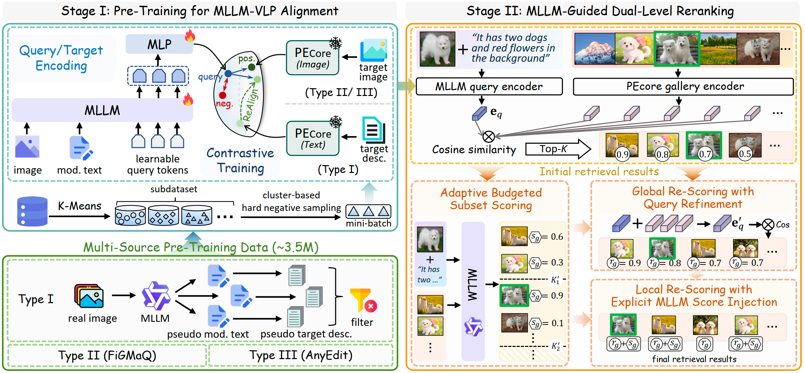
<strong>UniCVR: From Alignment to Reranking for Unified Zero-Shot Composed Visual Retrieval</strong> Haokun Wen, Xuemeng Song, <strong>Haoyu Zhang</strong>, Xiangyu Zhao, Weili Guan, Liqiang Nie arXiv 2604.20318, 2026 <a href="https://arxiv.org/abs/2604.20318">[Paper]</a>
</li>
                <li>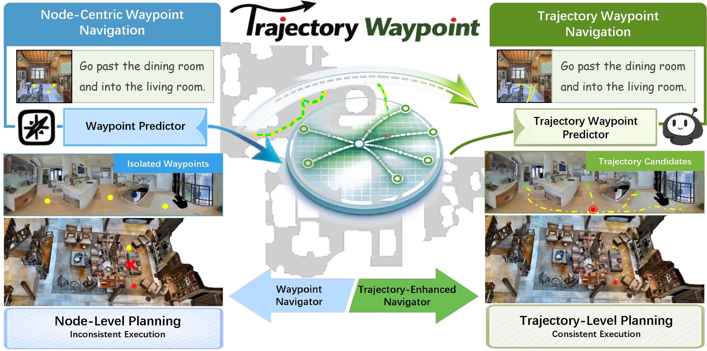
<strong>Beyond Waypoints: A Trajectory-Centric Waypointing Paradigm for Vision-Language Navigation</strong> Haoxiang Shi, Xiang Deng, <strong>Haoyu Zhang</strong>, Qiaohui Chu, Yaowei Wang, Liqiang Nie ACM MM 2026, CCF-A <a href="https://arxiv.org/abs/2606.07244">[Paper]</a>
</li>
                <li>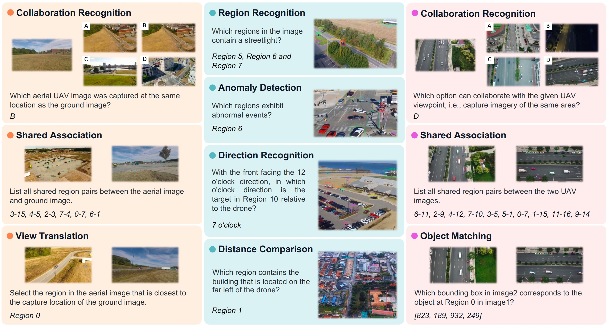
<strong>SpatialUAV: Benchmarking Spatial Intelligence for Low-Altitude UAV Perception, Collaboration, and Motion</strong> <strong>Haoyu Zhang</strong>, Meng Liu, Qianlong Xiang, Kun Wang, Yaowei Wang, Liqiang Nie arXiv 2606.27876, 2026 <a href="http://arxiv.org/abs/2606.27876">[Paper]</a> <a href="https://github.com/Hyu-Zhang/SpatialUAV">[Code]</a> <a href="https://huggingface.co/datasets/Hyu-Zhang/SpatialUAV">[Data]</a> <a href="https://mp.weixin.qq.com/s/n36ivwZlKW32-hzyGoTO9g">[Wechat]</a>
</li>
                <li>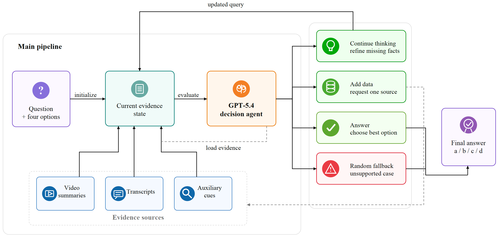
<strong>MARS: Technical Report for the CASTLE Challenge at EgoVis 2026</strong> <strong>Haoyu Zhang</strong>, Qiaohui Chu, Yisen Feng, Meng Liu, Weili Guan, Yaowei Wang, Liqiang Nie CVPR 2026 EgoVis Workshop <a href="https://arxiv.org/pdf/2605.18176">[Paper]</a> <a href="https://github.com/Hyu-Zhang/MARS">[Code]</a> <a href="https://www.codabench.org/competitions/13742/#/pages-tab">[Website]</a>Runner-up in the VQA Track of the CASTLE Challenge (2/44)
</li>
                <li>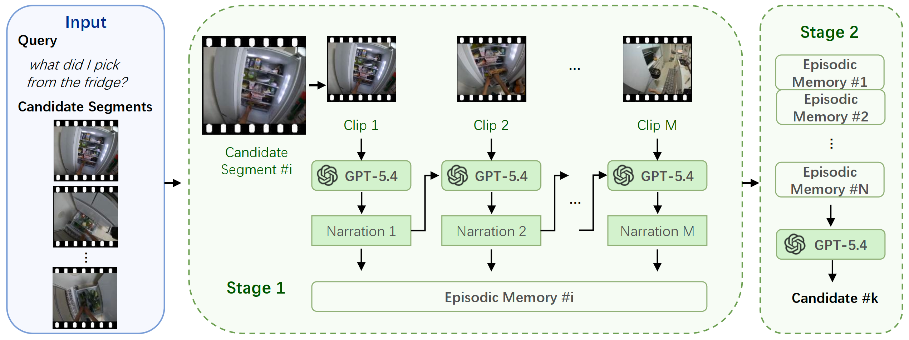
<strong>OSGNet with MLLM Reranking @ Ego4D Episodic Memory Challenge 2026</strong> Yisen Feng, Leigang Qu, <strong>Haoyu Zhang</strong>, Qiaohui Chu, Meng Liu, Xuemeng Song, Weili Guan, Liqiang Nie CVPR 2026 EgoVis Workshop <a href="https://arxiv.org/pdf/2605.20818">[Paper]</a> <a href="https://github.com/iLearn-Lab/CVPR25-OSGNet">[Code]</a> <a href="https://www.codabench.org/competitions/15262/#/pages-tab">[Website-NLQ]</a> <a href="https://www.codabench.org/competitions/14878/#/pages-tab">[Website-GS]</a>Champion in the Natural Language Query and Goal Step Tracks of the Ego4D Challenge (1/19, 1/17)
</li>
                <li>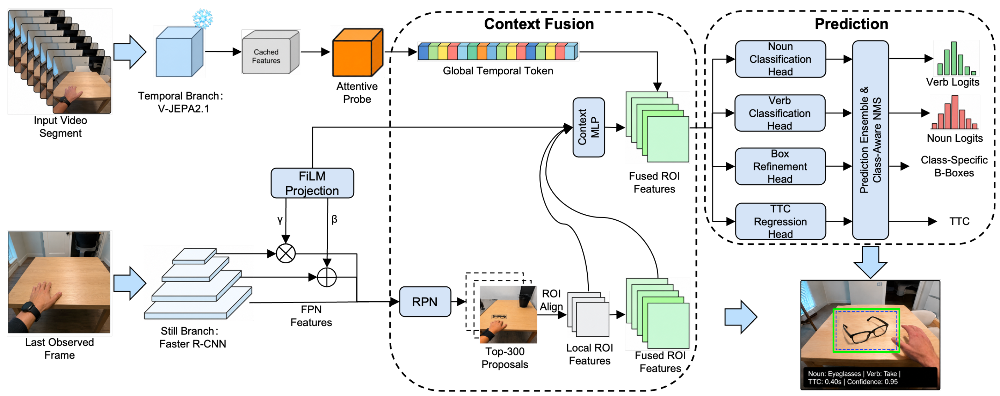
<strong>VISTA: Technical Report for the Ego4D Short-Term Object Interaction Anticipation at EgoVis 2026</strong> Qiaohui Chu, <strong>Haoyu Zhang</strong>, Yisen Feng, Meng Liu, Weili Guan, Dongmei Jiang, Liqiang Nie CVPR 2026 EgoVis Workshop <a href="https://arxiv.org/pdf/2605.20901">[Paper]</a> <a href="https://github.com/CorrineQiu/VISTA">[Code]</a> <a href="https://www.codabench.org/competitions/14477/#/pages-tab">[Website]</a>Champion in the Short-Term Object Interaction Anticipation Track of the Ego4D Challenge (1/21)
</li>
                <li>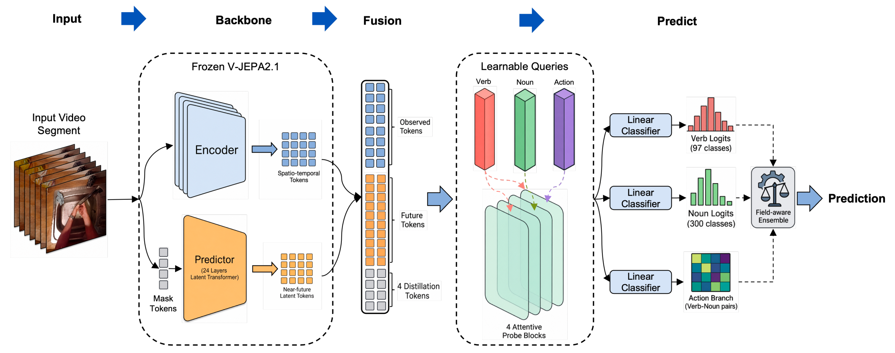
<strong>JFAA: Technical Report for the EPIC-KITCHENS-100 Action Anticipation Challenge at EgoVis 2026</strong> Qiaohui Chu, <strong>Haoyu Zhang</strong>, Yisen Feng, Meng Liu, Weili Guan, Dongmei Jiang, Liqiang Nie CVPR 2026 EgoVis Workshop <a href="https://arxiv.org/pdf/2605.20904">[Paper]</a> <a href="https://github.com/CorrineQiu/JFAA">[Code]</a> <a href="https://www.codabench.org/competitions/14471/#/pages-tab">[Website]</a>Champion in the Action Anticipation Track of the EPIC-KITCHENS Challenge (1/18)
</li>
                <li>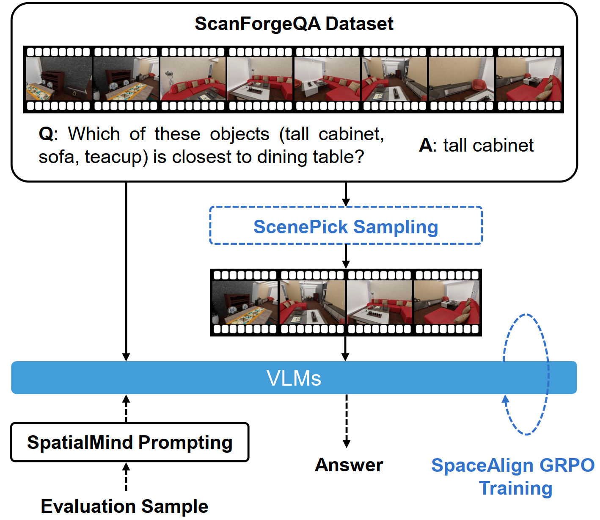
<strong>SpaceEra++: A Unified Framework Towards 3D Spatial Reasoning in Video</strong> Weili Guan, <strong>Haoyu Zhang</strong>, Meng Liu, Qianlong Xiang, Yaowei Wang, Liqiang Nie IEEE TPAMI 2026, CCF-A, SCI-1, IF 24.3 <a href="https://arxiv.org/abs/2607.01784">[Paper]</a> <a href="https://github.com/iLearn-Lab/NeurIPS25-SpaceEra">[Code]</a>Best Oral Presentation Award at PolyU COMP-HIT (Shenzhen) CST Research Student Conference
</li>
                <li>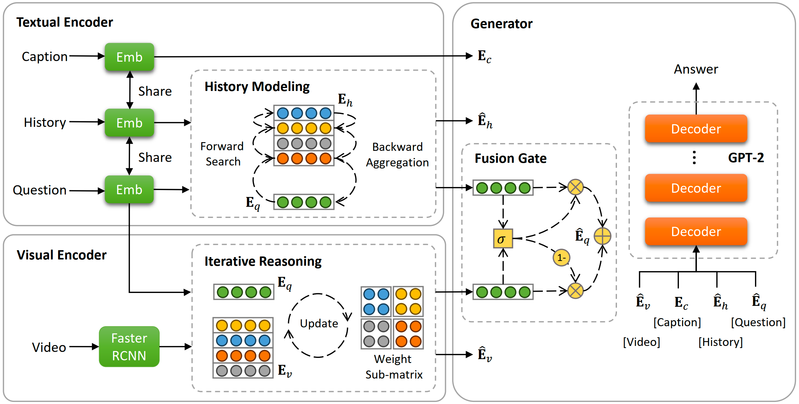
<strong>Uncovering Hidden Connections: Iterative Search and Reasoning for Video-grounded Dialog</strong> <strong>Haoyu Zhang</strong>, Meng Liu, Yisen Feng, Yaowei Wang, Weili Guan, Liqiang Nie ACM TOIS 2026, CCF-A, SCI-1, IF 9.1 <a href="https://arxiv.org/abs/2310.07259">[Paper]</a> <a href="https://github.com/iLearn-Lab/TOIS26-ISR">[Code]</a>
</li>
                <li>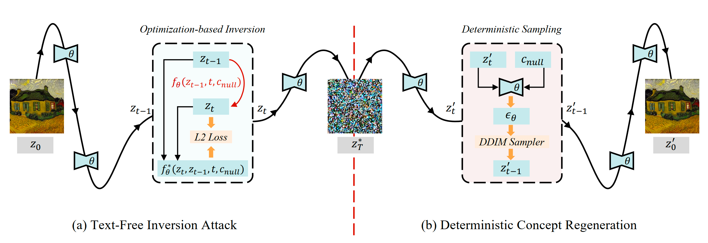
<strong>TINA: Text-Free Inversion Attack for Unlearned Text-to-Image Diffusion Models</strong> Qianlong Xiang, Miao Zhang, <strong>Haoyu Zhang</strong>, Kun Wang, Junhui Hou, Liqiang Nie CVPR 2026, CCF-A <a href="https://arxiv.org/abs/2603.17828">[Paper]</a> <a href="https://github.com/iLearn-Lab/CVPR26-TINA">[Code]</a>
</li>
                <li>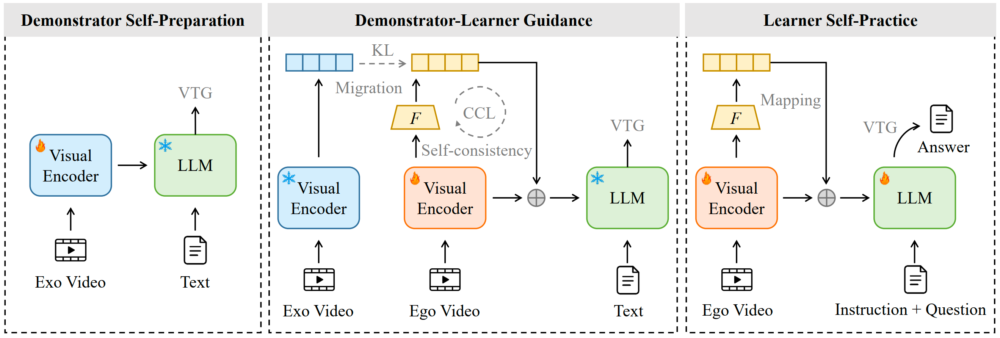
<strong>Exo2Ego: Exocentric Knowledge Guided MLLM for Egocentric Video Understanding</strong> <strong>Haoyu Zhang</strong>, Qiaohui Chu, Meng Liu, Haoxiang Shi, Yaowei Wang, Liqiang Nie AAAI 2026, CCF-A <a href="https://arxiv.org/abs/2503.09143">[Paper]</a> <a href="https://github.com/iLearn-Lab/AAAI26-Exo2Ego">[Code]</a> <a href="https://egovisiongroup.github.io/Exo2Ego.github.io/">[Project]</a>
</li>
                <li>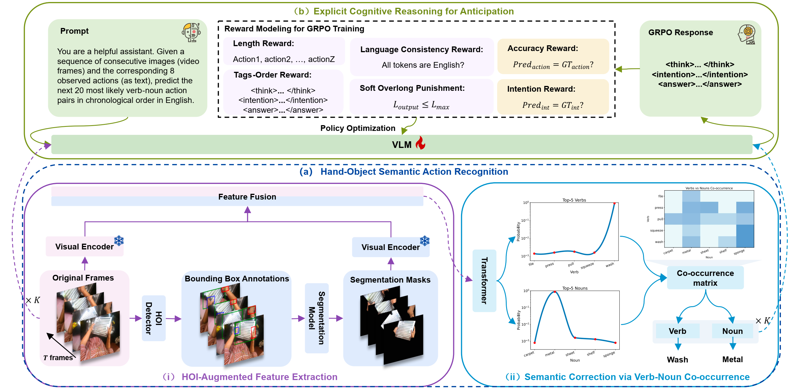
<strong>Intention-Guided Cognitive Reasoning for Egocentric Long-Term Action Anticipation</strong> Qiaohui Chu, <strong>Haoyu Zhang</strong>, Meng Liu, Yisen Feng, Haoxiang Shi, Liqiang Nie AAAI 2026, CCF-A <a href="https://arxiv.org/abs/2508.01742">[Paper]</a> <a href="https://github.com/iLearn-Lab/AAAI26-INSIGHT">[Code]</a>
</li>
                <li>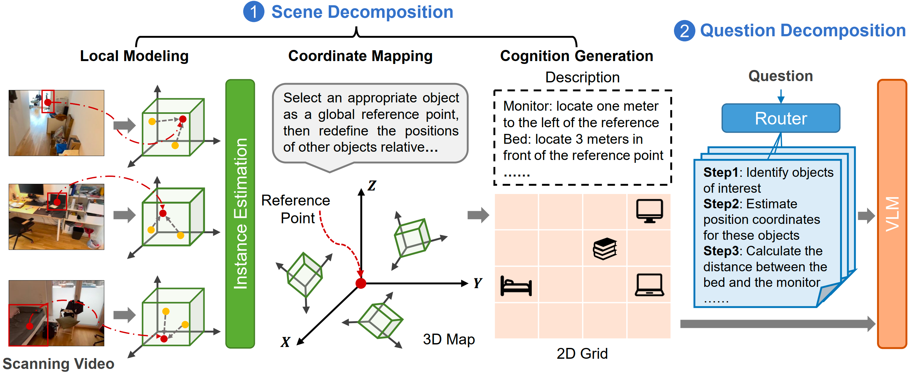
<strong>Spatial Understanding from Videos: Structured Prompts Meet Simulation Data</strong> <strong>Haoyu Zhang</strong>, Meng Liu, Zaijing Li, Haokun Wen, Weili Guan, Yaowei Wang, Liqiang Nie NeurIPS 2025, CCF-A <a href="https://www.arxiv.org/abs/2506.03642">[Paper]</a> <a href="https://github.com/Hyu-Zhang/SpatialMind">[Code]</a>Spotlight (Top 3%)
</li>
                <li>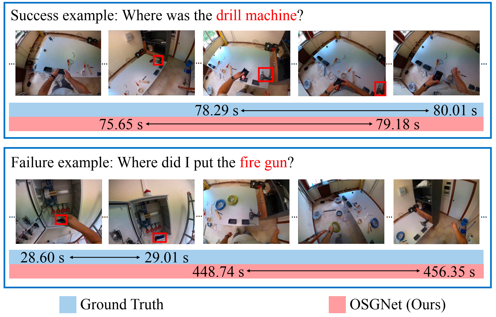
<strong>OSGNet @ Ego4D Episodic Memory Challenge 2025</strong> Yisen Feng, <strong>Haoyu Zhang</strong>, Qiaohui Chu, Meng Liu, Weili Guan, Yaowei Wang, Liqiang Nie CVPR 2025 EgoVis Workshop <a href="https://www.arxiv.org/abs/2506.03710">[Paper]</a> <a href="https://www.youtube.com/watch?v=AIO9LZMbbuA">[Video]</a> <a href="https://github.com/Yisen-Feng/OSGNet">[Code]</a> <a href="https://eval.ai/web/challenges/challenge-page/1626/overview">[Website-MQ]</a> <a href="https://eval.ai/web/challenges/challenge-page/1629/overview">[Website-NLQ]</a> <a href="https://eval.ai/web/challenges/challenge-page/2188/overview">[Website-GS]</a>Oral PresentationChampion in the Moment Queries, Natural Language Query, and Goal Step Tracks of the Ego4D Challenge (1/17, 1/28, 1/7)
</li>
                <li>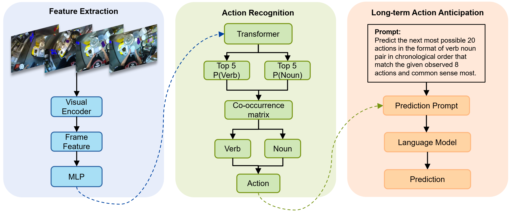
<strong>Technical Report for Ego4D Long-Term Action Anticipation Challenge 2025</strong> Qiaohui Chu, <strong>Haoyu Zhang</strong>, Yisen Feng, Meng Liu, Weili Guan, Yaowei Wang, Liqiang Nie CVPR 2025 EgoVis Workshop <a href="https://arxiv.org/abs/2506.02550">[Paper]</a> <a href="https://github.com/CorrineQiu/Ego4D-LTA-Challenge-2025">[Code]</a> <a href="https://eval.ai/web/challenges/challenge-page/1598/overview">[Website]</a>Champion in the Long-Term Action Anticipation Track of the Ego4D Challenge (1/18)
</li>
                <li>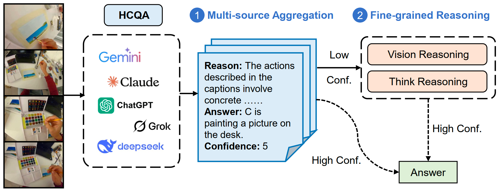
<strong>HCQA-1.5 @ Ego4D EgoSchema Challenge 2025</strong> <strong>Haoyu Zhang</strong>, Yisen Feng, Qiaohui Chu, Meng Liu, Weili Guan, Yaowei Wang, Liqiang Nie CVPR 2025 EgoVis Workshop <a href="https://arxiv.org/abs/2505.20644">[Paper]</a> <a href="https://github.com/Hyu-Zhang/HCQA">[Code]</a> <a href="https://eval.ai/web/challenges/challenge-page/2238/overview">[Website]</a>Third place in the EgoSchema Track of the Ego4D Challenge
</li>
                <li>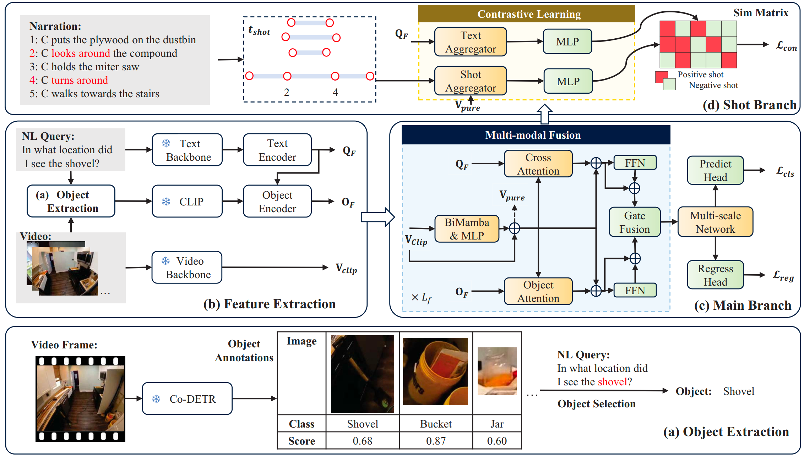
<strong>Object-Shot Enhanced Grounding Network for Egocentric Video</strong> Yisen Feng, <strong>Haoyu Zhang</strong>, Meng Liu, Weili Guan, Liqiang Nie CVPR 2025, CCF-A <a href="https://openaccess.thecvf.com/content/CVPR2025/html/Feng_Object-Shot_Enhanced_Grounding_Network_for_Egocentric_Video_CVPR_2025_paper.html">[Paper]</a> <a href="https://github.com/Yisen-Feng/OSGNet">[Code]</a>
</li>
                <li>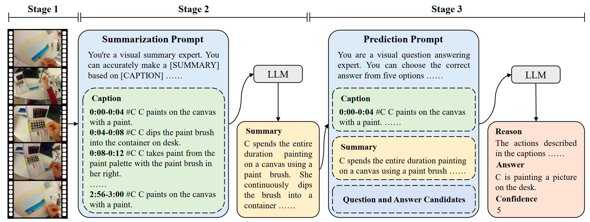
<strong>HCQA @ Ego4D EgoSchema Challenge 2024</strong> <strong>Haoyu Zhang</strong>, Yuquan Xie, Yisen Feng, Zaijing Li, Meng Liu, Liqiang Nie CVPR 2024 EgoVis Workshop <a href="https://arxiv.org/abs/2406.15771">[Paper]</a> <a href="https://github.com/Hyu-Zhang/HCQA">[Code]</a> <a href="https://eval.ai/web/challenges/challenge-page/2238/overview">[Website-ES]</a> <a href="https://www.kaggle.com/competitions/egoschema-public/leaderboard">[Website-Kaggle]</a>Champion in the EgoSchema Track of the Ego4D Challenge (1/13) and Champion in the Kaggle EgoSchema Competition (1/72)
</li>
                <li>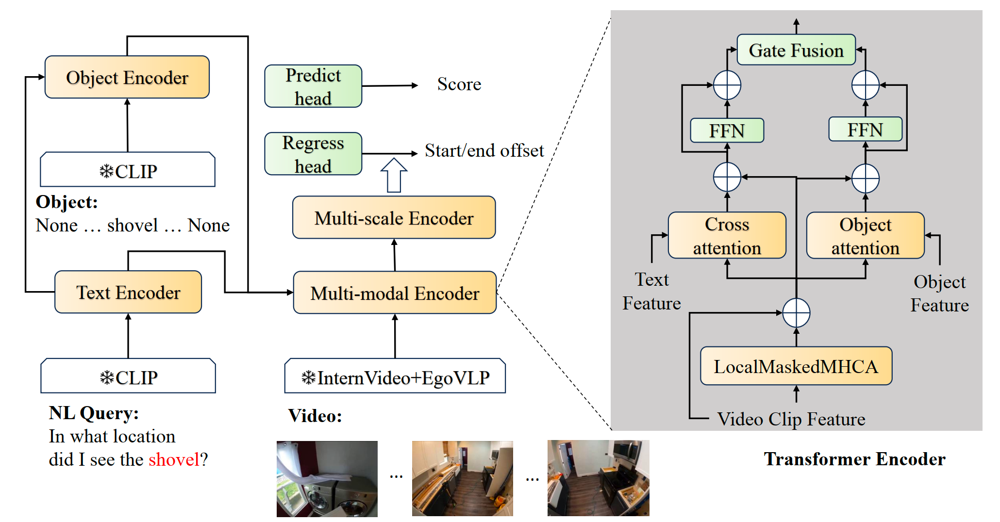
<strong>ObjectNLQ @ Ego4D Episodic Memory Challenge 2024</strong> Yisen Feng, <strong>Haoyu Zhang</strong>, Yuquan Xie, Zaijing Li, Meng Liu, Liqiang Nie CVPR 2024 EgoVis Workshop <a href="https://arxiv.org/abs/2406.15778">[Paper]</a> <a href="https://github.com/Yisen-Feng/ObjectNLQ">[Code]</a> <a href="https://eval.ai/web/challenges/challenge-page/1629/overview">[Website-NLQ]</a> <a href="https://eval.ai/web/challenges/challenge-page/2188/overview">[Website-GS]</a>Runner-up in the Natural Language Query Track and Third place in the Goal Step Track of the Ego4D Challenge
</li>
                <li>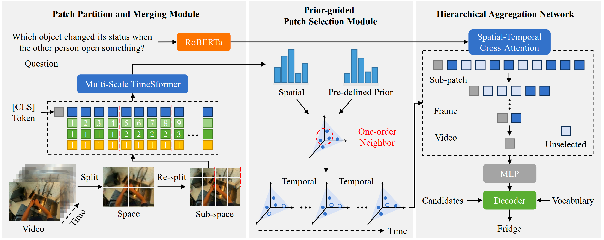
<strong>Multi-Factor Adaptive Vision Selection for Egocentric Video Question Answering</strong> <strong>Haoyu Zhang</strong>, Meng Liu, Zixin Liu, Xuemeng Song, Yaowei Wang, Liqiang Nie ICML 2024, CCF-A <a href="https://proceedings.mlr.press/v235/zhang24aj.html">[Paper]</a> <a href="https://github.com/Hyu-Zhang/EgoVideoQA">[Code]</a>
</li>
                <li>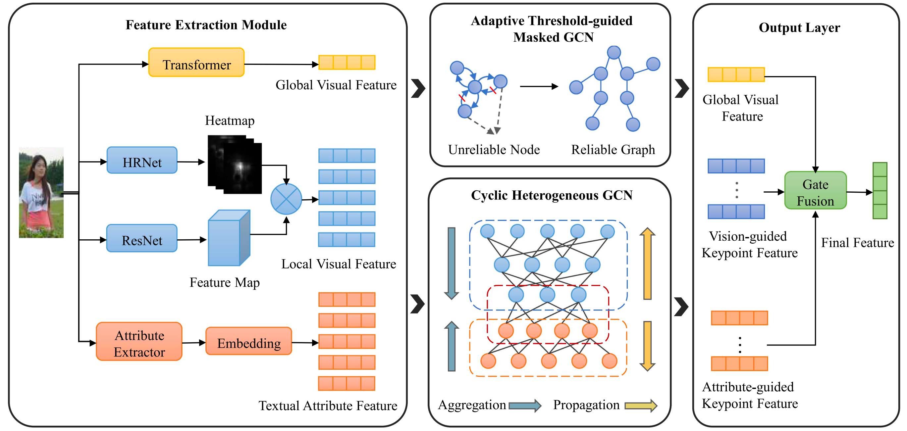
<strong>Attribute-guided Collaborative Learning for Partial Person Re-identification</strong> <strong>Haoyu Zhang</strong>, Meng Liu, Yuhong Li, Ming Yan, Zan Gao, Xiaojun Chang, Liqiang Nie IEEE TPAMI 2023, CCF-A, SCI-1, IF 24.3 <a href="https://ieeexplore.ieee.org/stamp/stamp.jsp?tp=&arnumber=10239469">[Paper]</a> <a href="">[Code]</a>
</li>
                <li>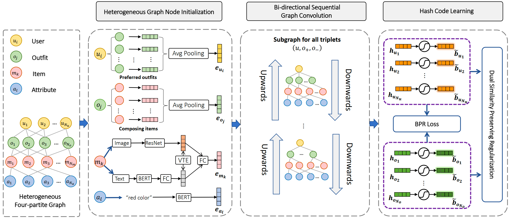
<strong>Bi-directional Heterogeneous Graph Hashing towards Efficient Outfit Recommendation</strong> Weili Guan, Xuemeng Song, <strong>Haoyu Zhang</strong>, Meng Liu, Chung-Hsing Yeh, Xiaojun Chang ACM MM 2022, CCF-A <a href="https://dl.acm.org/doi/pdf/10.1145/3503161.3548020">[Paper]</a> <a href="https://outfitrec.wixsite.com/bihgh">[Code]</a>Oral (Top 5.9%)
</li>
                <li>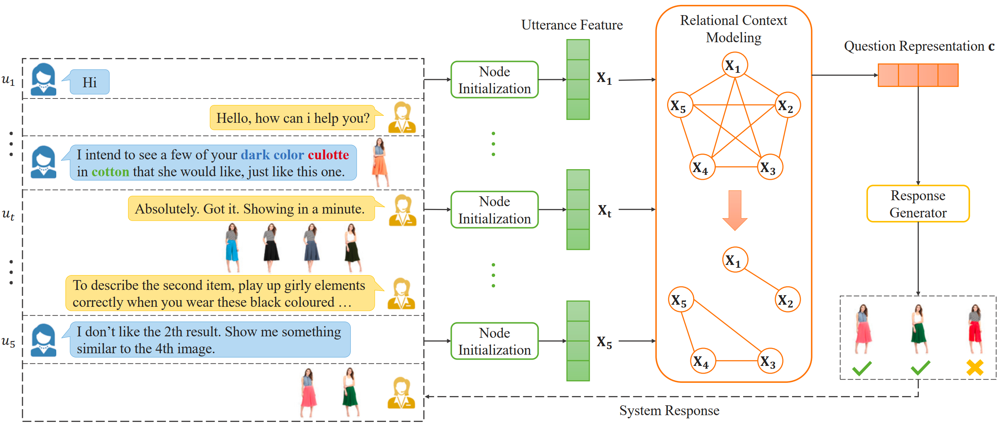
<strong>Multimodal Dialog System: Relational Graph-based Context-aware Question Understanding</strong> <strong>Haoyu Zhang</strong>, Meng Liu, Zan Gao, Xiaoqiang Lei, Yinglong Wang, Liqiang Nie ACM MM 2021, CCF-A <a href="https://dl.acm.org/doi/pdf/10.1145/3474085.3475234">[Paper]</a> <a href="https://acmmmtreasure.wixsite.com/treasure">[Code]</a>
</li>
              </ol>
            

          

        

      </section>

      <section id="awards" class="home-section wg-markdownme">
        

          
<h1 class="mb-0">Awards</h1>

          <ul class="award-list">
            <li><i class="fas fa-medal award-medal"></i>Best Oral Presentation Award at PolyU COMP-HIT (Shenzhen) CST Research Student Conference, 2026</li>
            <li><i class="fas fa-medal award-medal"></i>Chunhui Innovation Achievement Award, 2026</li>
            <li><i class="fas fa-medal award-medal"></i>Heilongjiang Provincial Model Student, 2025</li>
            <li><i class="fas fa-medal award-medal"></i>Tat-Seng Chua Scholarship, 2025</li>
            <li><i class="fas fa-medal award-medal"></i>NeurIPS Scholar Award, 2025</li>
            <li><i class="fas fa-medal award-medal"></i>INSUN Education Scholarship, 2024</li>
            <li><i class="fas fa-medal award-medal"></i>ICML Travel Award, 2024</li>
            <li><i class="fas fa-medal award-medal"></i>Second and Third Prize at the Xinchuang and Digital Economy Postdoctoral Haihe Academic Event, 2023</li>
            <li><i class="fas fa-medal award-medal"></i>Outstanding Graduates of Shandong University, 2023</li>
            <li><i class="fas fa-medal award-medal"></i>National Scholarship, 2021</li>
            <li><i class="fas fa-medal award-medal"></i>ACM MM Student Travel Award, 2021</li>
            <li><i class="fas fa-medal award-medal"></i>Outstanding Graduates of Shandong Province, 2020</li>
            <li><i class="fas fa-medal award-medal"></i>Top 10 Outstanding Students in the School of Computer Science and Engineering, 2019</li>
          </ul>
        

      </section>

      <section id="competitions" class="home-section wg-markdownme">
        

          
<h1 class="mb-0">Competitions</h1>

          <ul class="competition-list">
            <li><i class="fas fa-trophy competition-trophy"></i>Rank 3rd in CVPR Computer Vision in the Wild Workshop, MindCube Challenge, 2026</li>
            <li><i class="fas fa-trophy competition-trophy"></i>Rank 1st in CVPR EgoVis Workshop, Ego4D Challenge - Natural Language Query Track, 2026</li>
            <li><i class="fas fa-trophy competition-trophy"></i>Rank 1st in CVPR EgoVis Workshop, Ego4D Challenge - Goal Step Track, 2026</li>
            <li><i class="fas fa-trophy competition-trophy"></i>Rank 1st in CVPR EgoVis Workshop, Ego4D Challenge - Short-Term Object Interaction Anticipation Track, 2026</li>
            <li><i class="fas fa-trophy competition-trophy"></i>Rank 1st in CVPR EgoVis Workshop, EPIC-Kitchens Challenge - Action Anticipation Track, 2026</li>
            <li><i class="fas fa-trophy competition-trophy"></i>Rank 2nd in CVPR EgoVis Workshop, CASTLE Challenge - VQA Track, 2026</li>
            <li><i class="fas fa-trophy competition-trophy"></i>Rank 1st in CVPR EgoVis Workshop, Ego4D Challenge - Long-Term Action Anticipation Track, 2025</li>
            <li><i class="fas fa-trophy competition-trophy"></i>Rank 1st in CVPR EgoVis Workshop, Ego4D Challenge - Moment Queries Track, 2025</li>
            <li><i class="fas fa-trophy competition-trophy"></i>Rank 1st in CVPR EgoVis Workshop, Ego4D Challenge - Natural Language Query Track, 2025</li>
            <li><i class="fas fa-trophy competition-trophy"></i>Rank 1st in CVPR EgoVis Workshop, Ego4D Challenge - Goal Step Track, 2025</li>
            <li><i class="fas fa-trophy competition-trophy"></i>Rank 3rd in CVPR EgoVis Workshop, Ego4D Challenge - EgoSchema Track, 2025</li>
            <li><i class="fas fa-trophy competition-trophy"></i>Rank 1st in Kaggle EgoSchema Competition, 2024</li>
            <li><i class="fas fa-trophy competition-trophy"></i>Rank 1st in CVPR EgoVis Workshop, Ego4D Challenge - EgoSchema Track, 2024</li>
            <li><i class="fas fa-trophy competition-trophy"></i>Rank 2nd in CVPR EgoVis Workshop, Ego4D Challenge - Natural Language Query Track, 2024</li>
            <li><i class="fas fa-trophy competition-trophy"></i>Rank 3rd in CVPR EgoVis Workshop, Ego4D Challenge - Goal Step Track, 2024</li>
          </ul>
        

      </section>

      <section id="experience" class="home-section wg-markdownme">
        

          
<h1 class="mb-0">Experience</h1>

          

<strong>Kuaishou Technology, Beijing</strong> Academic Intern, Community Science, Jul 2024 - Jul 2025 Project: Multimodal Large Language Model.

          

<strong>Alibaba Group, Hangzhou</strong> Academic Intern, Alibaba Cloud Intelligence, Wed 2022 - Jul 2022 Project: Partial Person Re-identification.

        

      </section>

      <section id="service" class="home-section wg-markdownme">
        

          
<h1 class="mb-0">Academic Service</h1>

          <ul class="service-list">
            <li>Conference Reviewer: CVPR 2025-2026, ICCV 2025, NeurIPS 2022-2025, ICML 2023-2025, ICLR 2024-2025, SIGIR 2025, ACM MM 2022-2026, AAAI 2025-2026, IJCAI 2024, ICMR 2025-2026, PRCV 2023-2024, ISCAS 2024, ECAI 2024.</li>
            <li>Journal Reviewer: IEEE TPAMI, IEEE TIP, IEEE TCSVT, IEEE TMM, IEEE TKDE, Information Sciences.</li>
            <li>Volunteer: ICML 2024, China3DV 2024.</li>
          </ul>
        

      </section>

      <!--
      <section id="education" class="home-section wg-markdownme">
        

          
<h1 class="mb-0">Education</h1>

          

<strong>Harbin Institute of Technology, Shenzhen</strong> School of Computer Science and Technology, PhD Student, Sep 2023 - Now Advisors: Prof. Liqiang Nie, Prof. Yaowei Wang, and Prof. Meng Liu.
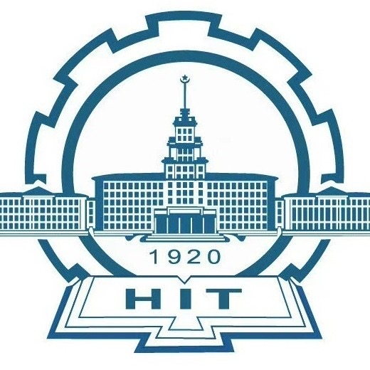

          

<strong>Shandong University</strong> School of Computer Science and Technology, M.S., Sep 2020 - Jun 2023 Advisors: Prof. Liqiang Nie and Prof. Meng Liu.

        

      </section>
      -->

    

  

